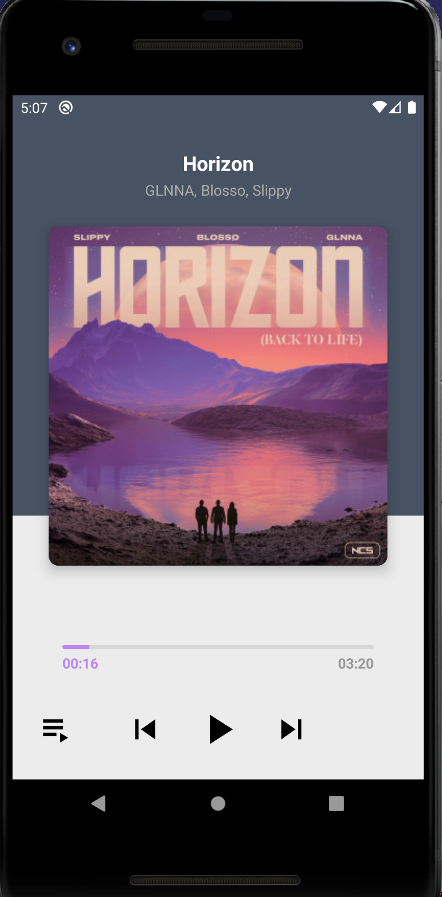

# kotlin-study-07 - Simple Music Player App

# 목차

1. 재생화면 UI 구성하기
2. 플레이리스트 UI 구성하기
3. 음악 목록 API 만들기
4. ExoPlayer를 이용하여 음악 재생하기 (1)

# 결과화면

# 사용 및 배운 것

- **Exoplayer** 사용하기
  - custom controller
  - Playlist 등
- androidx.constraintlayout.widget.Group
- **Seekbar** Custom 하기

### ExoPlayer
- Google이 Android SDK 와 별도로 배포되는 오픈소스 프로젝트
- 오디오 및 동영상 재생 가능
- 오디오 및 동영상 재생 관련 강력한 기능들 포함
- 유튜브 앱에서 사용하는 라이브러리
- https://exoplayer.dev/hello-world.html

---
